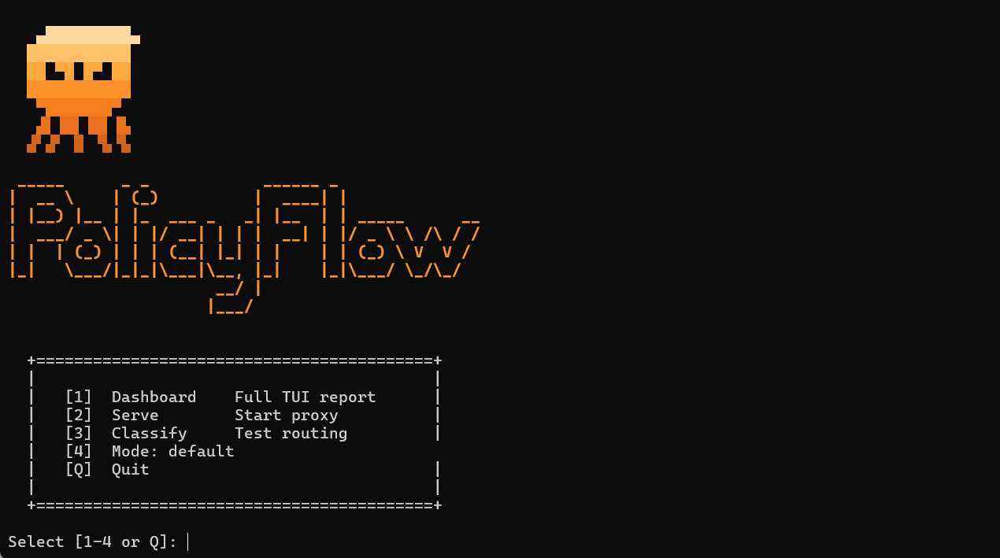
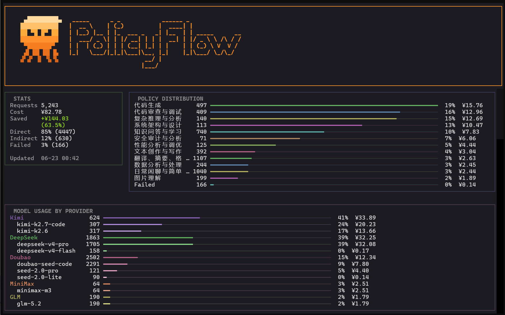
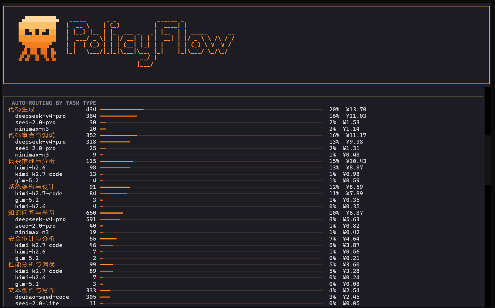
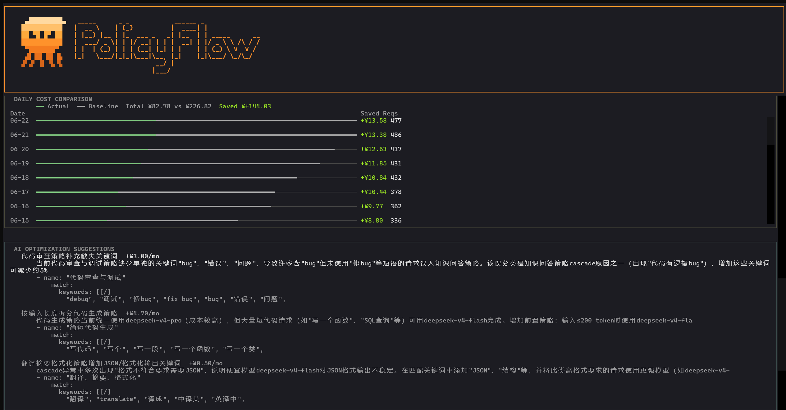

# PolicyFlow 🐙

> 该省省该花花，一个替你的请求挑对模型的本地智能路由。

<p align="center"></p>

**用旗舰模型回一句"你好，在吗"，就像开着跑车去菜市场——不是不能用，是不值当。**

PolicyFlow 做的就是这样一件事：识别每次请求的真实难度，简单任务交给便宜模型处理，复杂任务保留顶级算力。它不靠猜测——你定义 YAML 策略，它自动改写 model 字段、切换对应的 API 端点。API 成本通常省下 40-65%，经上千次真实请求测试的中位数约 58%。

**你的 YAML。你的 Key。没有黑盒。** 策略即配置，改一行生效，不藏逻辑在代码里。供应商 API Key 直连，不做中间代理。你的模型你做主。

<p align="center">
  支持 <strong>Cursor</strong> · <strong>Claude Code</strong> · <strong>Codex CLI</strong> · <strong>Aider</strong> · <strong>ChatBox</strong> · <strong>OpenAI SDK</strong> · <strong>Anthropic 原生协议</strong> · 任意 OpenAI 或 Anthropic 兼容客户端
</p>

**一次普通办公会话，省了多少：**

```
  "帮我翻译这封邮件"          → deepseek-v4-flash      ¥0.01
  "debug 这段代码, 报错了"    → deepseek-v4-pro        ¥0.14
  "设计支付系统的数据模型"     → kimi-k2.7-code          ¥1.27
  "帮我写个 SQL 查询"         → deepseek-v4-pro        ¥0.08
  "推荐几本好看的科幻小说"       → deepseek-v4-flash      ¥0.01

  路由后实际花费 ¥1.50    如果全用 kimi-k2.7-code  ¥2.15

  单次会话省 30%。日常流量里翻译/闲聊/格式化这类轻任务占大多数
  （~70%），实际月省更高。经1000多次真实请求测试后约省 58%。
```
## "从裸调 API 到智能调度，PolicyFlow 能做什么？"

- **YAML 即策略，改一行生效。** 不写死在代码里——今天觉得"翻译"该走便宜模型，打开 yaml 把 max_cost_tier 从 mid 改成 cheap，重启即生效。
- **两种方式自由组合。** 想精确控制？写 `route_to` 把这任务钉死到一个模型，你说翻译任务用豆包，我就用豆包。想省心？算法帮你选， 8 维能力分（编码、推理、写作、多语言……），12个任务类型各有对应的八个维度权重。翻译看重写作和多语言，架构看重编码和推理，帮你选出最合适的那一个。
- **自建 Key 和平台套餐统一调度，规则透明。** 各大模型的直连 Key、各厂商Coding Plan的聚合 Key（一个 Key 下挂 Kimi/GLM/豆包/MiniMax 等多个模型）在同一条 YAML 里管理，策略统一分配到各自端点。平台 auto 的局限在于：规则不透明（无法解释为何选 A 不选 B），范围局限于套餐内模型，无法纳入自建 Key。PolicyFlow 取消了这两条边界——所有来源的模型在同一任务维度下按同一套能力评分竞争，你定策略，你来dispatch，逻辑完全可见。
- **双维静默容灾。** 提供"供应商"与"模型"两层保障：支持同模型多 Provider 轮询，主Provider挂了（断连、额度耗尽）自动切备用Provider；同时每个任务支持配置 Top-3 候选模型，主模型不可用时秒切备选。双重防线兜底，全程无感，丝滑 Coding。
- **省了多少全记着。** 每条请求记入 SQLite——走了哪个策略、花了多少钱、和 baseline 比省了多少。有全屏 TUI 仪表盘，有 AI 优化引擎（分析日志出建议），有 CLI export 给你二次分析。

> 想看内部怎么路由？跳到 [#核心流程](#核心流程)。

## 怎么用

PolicyFlow 运行在你的本地环境（默认监听 localhost:8000）。你只需把手头 AI 工具的 API Base URL 指向它，剩下的调度工作全部自动完成。不改代码、不存 Key、不碰数据。 它不属于任何第三方中介，就是一个完全透明的私有本地代理。

```
你的工具（Cursor / Claude Code / codex / …）
  └→ POST localhost:8000/v1/chat/completions
     { "model": "随便写", "messages": [...] }  

         PolicyFlow
           ├─ 看了你的消息，匹配策略
           ├─ 改写 model，切到对应供应商
           ├─ 转发请求，拿到响应
           └─ 把响应原样返回（附 X-PolicyFlow-* 头，告诉你走了哪个策略）

  响应回你的工具，和直连供应商一样。
```

## 快速开始

### 1. 安装

```bash
git clone https://github.com/Anakin7n/PolicyFlow.git
cd PolicyFlow
pip install -r requirements.txt
```

如果使用虚拟环境（推荐），先创建并激活：
```bash
python -m venv .venv
source .venv/bin/activate          # Linux/Mac
# .venv\Scripts\activate           # Windows
pip install -r requirements.txt
```

### 2. 配置

PolicyFlow 用两个文件分工：
- **`.env`** — 放 API Key（敏感信息，不入 git）
- **`policyflow.yaml`** — 放策略和 provider 配置，里面用 `${VAR_NAME}` 引用 `.env` 里的 Key

复制示例文件填入你自己的设置：

```bash
cp .env.example .env                # 填 API Key
cp policyflow.example.yaml policyflow.yaml   # 策略配置
```

两个文件都已加入 `.gitignore`，不会被提交到 git，放心填。

#### .env 怎么填

`.env` 是个简单的 `KEY=VALUE` 文件，每行一个 API Key。**变量名你自己起**——`policyflow.yaml` 用 `${VAR_NAME}` 语法引用即可：

```bash
# .env 示例
UPSTREAM_API_KEY=sk-your-main-key       # 必填：默认兜底 API
DEEPSEEK_API_KEY=sk-xxx                 # 想用 deepseek 时填
ANTHROPIC_API_KEY=sk-ant-xxx            # 想用 claude 时填
MY_COMPANY_TOKEN=internal-xxx           # 自己加的供应商，名字随便起
```

```yaml
# policyflow.yaml 中引用
providers:
  deepseek:
    api_key: "${DEEPSEEK_API_KEY}"      # ← 与 .env 里的变量名对应
  internal:
    api_key: "${MY_COMPANY_TOKEN}"      # ← 你自己起的名字也行
```

**唯一必填的是 `UPSTREAM_API_KEY`**——其他全是按需填（用哪个供应商就填哪个）。`.env.example` 里已经预设了主流供应商（DeepSeek、Qwen、GLM、Kimi、Doubao、Anthropic、OpenAI 等）的命名建议；要加新供应商就自己往 `.env` 添一行新变量名。

### policyflow.yaml 配置清单

打开 `policyflow.yaml`，按以下顺序改：

| 段落 | 作用 |
|------|------|
| `providers` | 配置你的模型供应商，每个供应商填 `base_url`、`api_key`（用 `${VAR}` 引用 `.env`）、模型列表。策略 `route_to` 的模型必须出现在某个 provider 里 |
| `upstream` | 最后兜底：模型找不到可用 provider 时（没声明、Key 无效、额度用完、挂了），请求发到这里并自动改写为 `fallback_model`。没配 `fallback_model` 则原样转发 |
| `embedding` | 语义匹配的 Embedding API 地址、模型、两个阈值（`similarity_threshold` 全局匹配 / `verify_threshold` 关键词复核）。不可用时自动降级 |
| `routing_mode` | 默认路由模式：`hybrid` / `capability` / `explicit`。启动菜单可临时覆盖 |
| `policies_hybrid` | hybrid 模式下的策略集，可混用写死模型和算法选模 |
| `policies_capability` | capability 模式下的策略集，全由算法选模 |
| `policies_explicit` | explicit 模式下的策略集，全写死模型 |
| `cascade` | 级联验证：规则检查 + 能力评分逐档升级。`max_retries` 控制最多升级次数 |
| `cost_tiers` | `max_cost_tier` 的分档边界（可选，省略用默认 cheap<0.5、mid<1.7） |
| `optimizer` | AI 优化引擎：是否启用、用哪个模型分析、最多几条建议。所用模型必须已在 `providers` 中配了真实 Key |
| `logging` | `log_prompt_preview` 是否记录提问原文（默认 `true`，利于优化建议；隐私敏感设 `false`，详见"AI 优化引擎"节） |

### Embedding 供应商配置

Embedding API 用于语义匹配（可选，不用也能跑）。默认配置是火山引擎豆包多模态 Embedding，换成其他供应商只需改 `policyflow.yaml` 中 `embedding` 段的三项：

```yaml
# policyflow.yaml 中的 embedding 段（按需改 base_url + model）
embedding:
  base_url: https://ark.cn-beijing.volces.com/api/v3            # ← 改这里
  api_key: "${EMBEDDING_API_KEY}"                                # ← .env 里填对应 key
  model: doubao-embedding-vision-251215                          # ← 改这里
  similarity_threshold: 0.55   # 全局语义匹配阈值
  verify_threshold: 0.55       # 关键词命中后复核阈值（避免歧义命中）
  timeout: 30
```

> ⚠️ **阈值要跟着 embedding 模型的尺度走**：不同模型的余弦相似度分布差异很大。当前默认 0.55 是基于 doubao-embedding-vision + 策略 centroid 描述的实测——真实任务的强匹配落在 0.6～0.8，无意义输入(空语义)落在 0.4～0.5,0.55 是清晰的分界线。如果你换成 OpenAI text-embedding 系(相关文本常达 0.5～0.8、弱相关 0.3～0.5)，阈值大致仍可用 0.55 但建议自测;换成尺度不同的其他模型时,**务必先测一批典型输入再定阈值**。判断方法：用 `policyflow classify "<典型问题>"` 看真实/无意义输入的分数分布,取它们中间的分界点。

> Embedding API 不填会怎样？路由自动降级：跳过关键词复核与全局语义匹配，仅用关键词精确匹配 + 兜底模型。不影响服务运行。

支持的 api_key 格式：直接写字符串或 `${ENV_VAR}` 引用环境变量。

#### 添加自定义供应商和模型

PolicyFlow 的 `providers` 段对**供应商数量、模型命名风格无任何限制**——任何 OpenAI 兼容的 API 都能接入（Mistral、Groq、Together AI、Ollama 等）。

> 所有 Key 都在 `.env` 里填，`policyflow.yaml` 通过 `${VAR_NAME}` 引用——变量名你自己起。详见前面 [配置节](#2-配置)。

**场景 1：给现有供应商加新模型**

供应商出了新模型，直接加进 `models` 列表：

```yaml
providers:
  deepseek:
    base_url: https://api.deepseek.com
    api_key: "${DEEPSEEK_API_KEY}"
    models:
      - "deepseek-v4-flash"
      - "deepseek-v4-pro"
      - "deepseek-v5"            # ← 新加的，立刻可用
```

**场景 2：加新供应商**

任何 OpenAI 兼容 API 都能接入，三步走。

第一步：在 `providers` 下面加一段。以接入 **Anthropic Claude** 为例：

```yaml
# policyflow.yaml
providers:
  anthropic:
    base_url: https://api.anthropic.com
    api_key: "${ANTHROPIC_API_KEY}"
    protocol: anthropic            # 直连 Anthropic 官方 API 才需要；中转站/聚合器不用
    models:
      - "claude-haiku-4-5"
      - "claude-sonnet-4-6"
      - "claude-opus-4-8"
```

第二步：在 `.env` 里填实际 Key：

```bash
# .env
ANTHROPIC_API_KEY=sk-ant-your-real-key
```

第三步：在策略里引用新模型：

```yaml
- name: "复杂推理与分析"
  match:
    keywords: ["架构设计", "数学证明", "策略分析"]
  route_to: "claude-opus-4-8"      # ← 新加的，立刻可用
```

**其他常见供应商**（同样 OpenAI 兼容，照上面三步替换即可）：

| 供应商 | base_url |
|---|---|
| Mistral | `https://api.mistral.ai/v1` |
| Groq | `https://api.groq.com/openai/v1` |
| Together AI | `https://api.together.xyz/v1` |
| 本地 Ollama | `http://localhost:11434/v1`（key 填 `"ollama"` 即可） |

**完整支持需要的 4 处改动**

加 `providers` 这一处只是让模型**能路由**——但要让 PolicyFlow 的智能选模、成本统计、自动窗口升级真正认识这个新模型，需要补全 4 处：

| 步骤 | 文件 | 加什么 | 不加的代价 |
|---|---|---|---|
| 1 | `policyflow.yaml` 的 `providers` 段 | 模型 ID 加进 `models` 列表 | **必填**——不加根本路由不到 |
| 2 | [policyflow/cost.py](policyflow/cost.py) 的 `MODEL_PRICES` | `"模型ID": (input价, output价)` | 仪表盘成本按 fallback `$1/M` 估算，**金额不准** |
| 3 | [policyflow/model_profiles.py](policyflow/model_profiles.py) 的 `PROFILES` | 8 维能力评分 + 价格 + 上下文窗口 | **能力路由失效**——不写 `route_to` 的策略选不到这个模型 |

**强烈建议三步全做。** 否则相当于把这个模型放进一个"哑路由"——只有写死 `route_to:` 才能用到，capability 模式和评分系统全部绕开它。如果你接入的是一个比内置模型更强或更便宜的新模型，第 3 步尤其重要——评分系统看不到它就永远不会选它，这等于浪费了 PolicyFlow 最有价值的功能。

第 3 步的 8 维评分需要主观判断（参考已有模型的相对水平），你可以从一个保守的起点开始，跑一段时间用 `policyflow optimize` 看实际表现再调。

### 3. 启动

```bash
# 如果用了虚拟环境，先激活
# .venv\Scripts\activate           # Windows
# source .venv/bin/activate        # Linux/Mac

# CLI 启动
python -m policyflow serve --host 0.0.0.0 --port 8000

# 或者直接用 uvicorn
python -m uvicorn policyflow.main:app --host 0.0.0.0 --port 8000
```

### 4. 使用

PolicyFlow 启动后同时暴露两个端点。接入就是填两个参数——**协议决定 URL，Key 随便写**：

| 协议 | URL | API Key | 哪些客户端用这个协议 |
|---|---|---|---|
| **OpenAI 兼容** | `http://localhost:8000/v1` | 任意字符串 | ChatBox、Cursor、Continue、OpenAI SDK、Codex CLI… |
| **Anthropic 原生** | `http://localhost:8000` | 任意字符串 | Claude Code、Claude SDK 等 Anthropic 原生客户端 |

> URL 为什么不一样？Anthropic 客户端自动拼 `/v1/messages`，所以填根路径；OpenAI 客户端自动拼 `/v1/chat/completions`，所以填 `/v1`。PolicyFlow 不校验 API Key——转发用的是 `.env` 里的供应商真实 Key。**两种协议走同一条路由管道**，Anthropic 请求在入口自动转格式，对用户透明。

**怎么设？** 两种形式，任选其一：

```bash
# 环境变量 — 当前终端里所有 agent 都受影响
export ANTHROPIC_BASE_URL="http://localhost:8000"    # Anthropic 协议
export ANTHROPIC_API_KEY="sk-anything"
export OPENAI_BASE_URL="http://localhost:8000/v1"    # OpenAI 协议
export OPENAI_API_KEY="sk-anything"
```

```json
// 配置文件 — 只影响这一个 agent，不影响其他
// ~/.claude/settings.json
{ "anthropicBaseURL": "http://localhost:8000", "apiKey": "sk-anything" }
```

**自己写代码** 同理，改 SDK 的 `base_url`：

```python
from openai import OpenAI
client = OpenAI(base_url="http://localhost:8000/v1", api_key="sk-anything")
```

**这次请求实际会发生什么？**（按默认 `policyflow.example.yaml` 策略追踪）：

1. PolicyFlow 收到请求，扫 `messages` 内容
2. 「帮我**翻译**这段话」命中「翻译、摘要、格式化」策略的关键词 + token<800
3. 策略 `route_to: "claude-haiku-4-5"` → 把 `model` 字段从 `gpt-4o` 改写为 `claude-haiku-4-5`
4. 查 `providers.anthropic`，请求转发到 `https://api.anthropic.com`，用 `${ANTHROPIC_API_KEY}` 鉴权
5. 响应原样返回给客户端，**响应头里带路由信息**：`X-PolicyFlow-Policy: 翻译、摘要、格式化`、`X-PolicyFlow-Method: keyword_verified`

如果你改成 `content="帮我设计一个秒杀系统的架构"`——会命中「复杂推理与分析」策略 → 路由到 `claude-opus-4-8`。每条请求按内容动态选模型，对客户端代码零侵入。

### Docker Compose

```bash
cp .env.example .env
cp policyflow.example.yaml policyflow.yaml
# 编辑 .env + policyflow.yaml，填入你的设置
docker compose up -d
```

## 一键启动

```bash
scripts\launcher.bat    # 双击或命令行运行

  [1] Dashboard   全屏仪表盘  → 选择 7d / 30d / 全部
  [2] Serve       启动代理 (0.0.0.0:8000)
  [3] Classify    测试路由
  [4] Mode        切换路由模式 (hybrid/capability/explicit)
  [Q] Quit
```



## CLI 命令

> 无需启动服务，直接运行即可。如果用了虚拟环境，先激活：`.venv\Scripts\activate`（Windows）或 `source .venv/bin/activate`（Linux/Mac）。

### report——全屏仪表盘

Textual 响应式 TUI 仪表盘，七个模块卡片，支持独立滚动：

- **Stats** — 总请求 / 花费 / 节省 / 匹配质量 (Direct / Indirect / Failed)
- **Policy Distribution** — 各策略花费占比柱状图
- **Model Usage by Provider** — 供应商 → 模型两级花费分解
- **Auto-Routing by Task Type** — capability 模式下的任务类型分布
- **Daily Cost Comparison** — 每日实际 vs 基准对比，含节省金额
- **AI Optimization** — 内嵌优化建议
- **Recent Requests** — 最近请求明细（可滚动）







```bash
python -m policyflow report
python -m policyflow report --since 7d
```

键盘操作：`Q` 退出，`R` 刷新，`Tab` 切换焦点，`↑↓`/滚轮在模块内滚动。

### classify——测试路由

```bash
python -m policyflow classify "帮我写一个排序算法"
```

### export——导出日志

```bash
python -m policyflow export --format csv --since 7d --output report.csv
python -m policyflow export --format json
```

### optimize——AI 优化建议

```bash
python -m policyflow optimize --since 30d
```

> 提示：Windows 用户可直接双击 `scripts\launcher.bat` 一键启动仪表盘或服务。

## 核心流程

```
你的客户端（Cursor / Claude Code / Codex CLI / Aider / ChatBox / OpenAI SDK 等）
  发请求过来 →
    OpenAI 兼容协议  → POST http://localhost:8000/v1/chat/completions
    Anthropic 原生协议 → POST http://localhost:8000/v1/messages   （Claude Code 等 Anthropic 原生客户端用）
  请求体: { model: "gpt-4o", messages: [...], tools?: [...] }
  │
  ↓ PolicyFlow 收到后依次跑下面 4 步
  │
  ├── ① 策略匹配（按 YAML policies 从上到下扫，只看当前轮最新一条用户消息）
  │     图片检测 → 命中即停
  │     关键词精确匹配命中 → Embedding 复核语境（≥阈值 才放行，挡掉"苹果"匹"苹果手机"这类歧义）
  │     未命中 → Embedding 全局语义匹配
  │     仍未命中 → 看会话记忆：本会话上一轮有模型则沿用（承接 "继续" 这类无语义跟进），
  │                否则走统一兜底模型（fallback_model）
  │     → 命中后确定任务类型（如"代码生成"、"复杂推理"）
  │
  ├── ② 路由决策：根据任务类型选模型
  │     策略写了 route_to → 直接用
  │     没写 route_to → 按任务类型的 8 维能力权重对可用模型打分，Top-3 加权随机（90/7/3）
  │     选定 model → 查 providers 映射 → 改写 model 字段 + 切对应 base_url
  │
  ├── ③ 级联验证（仅非流式请求）
  │     模型作答 → 规则验证器评估
  │     不通过 → 沿能力评分升一档重试（最多 max_retries 次）
  │
  └── ④ 成本记录   SQLite 写一行：策略命中、最终模型、token、
                   费用、judge 反馈 —— 供 report / optimize 命令分析

CLI 工具：
  policyflow report   → 全屏 TUI 仪表盘(成本/策略/模型/日趋势)
  policyflow classify → 测试路由("这句话会匹配到哪个策略?")
  policyflow optimize → AI 优化建议(分析日志,推荐新策略)
  policyflow export   → 导出 CSV 日志
```

## 策略配置

策略在 `policyflow.yaml` 里定义。每条策略回答两个问题：**什么请求命中它**，以及**命中后用哪个模型**。

### 模型选择：两种方式，按策略混用

命中策略后，最终用哪个模型有两种模式，每一条策略独立选择：

**方式 A：你指定模型**

```yaml
- name: "代码生成"
  match:
    keywords: ["写代码", "SQL查询", "API接口"]       # ← 仅示意；完整列表见 example.yaml
  route_to: "claude-sonnet-4-6"                      # 命中后一定用这个模型
```

**方式 B：系统帮你选**

```yaml
- name: "代码生成"
  match:
    keywords: ["写代码", "SQL查询", "API接口"]
  # 不写 route_to → 系统按"代码生成"任务类型自动算分选最优模型
```

系统会根据你配的所有模型的 8 维能力数据 + 实时价格，自动挑出最适合这个任务且价格合理的模型。比如代码任务 DeepSeek V4 Pro 代码分 0.87、价格 $0.43/百万 token，Claude Sonnet 代码分 0.88 但价格 $15/百万 token——系统会选 DeepSeek，能力几乎一样但便宜 34 倍。

两种方式可以混用：重要的策略自己锁死模型，不重要的交给系统。

### 全局开关：一键切换所有策略

`policyflow.yaml` 顶部的 `routing_mode` 可以一键覆盖所有策略的模式，不用逐条改。也可用环境变量 `POLICYFLOW_ROUTING_MODE` 覆盖，重启生效。

| 模式 | 效果 |
|------|------|
| `hybrid`（默认） | 每条策略独立决定用方式 A 还是 B，互不干扰 |
| `explicit` | 所有策略强制方式 A——每一条都必须写 `route_to` |
| `capability` | 所有策略强制方式 B——不写 `route_to`，系统自动选 |

```yaml
# policyflow.yaml 顶部
routing_mode: hybrid
```

### 匹配方式：五种触发条件

`match` 字段支持的所有键（**多个条件同时满足才命中**，AND 逻辑）：

| 字段 | 类型 | 含义 |
|---|---|---|
| `keywords` | string[] | 关键词列表，命中任一即算命中。先精确子串匹配（命中后做 Embedding 复核挡掉歧义），仍未命中再走 Embedding 全局语义匹配（阈值 0.55） |
| `max_input_tokens` | int | 输入 token **不超过**这个数才命中。配 `keywords` 用来防止长文被错归 |
| `min_input_tokens` | int | 输入 token **不小于**这个数才命中。用来过滤掉太短的请求 |
| `has_image` | bool | 请求含图片才命中（多模态请求） |

### 关键词匹配 + Embedding 复核

关键词匹配是大小写不敏感的子串匹配（OR 逻辑：数组里任一关键词出现在 prompt 里即命中）。

**关键词命中后会做一次 Embedding 复核**——把 prompt 跟该策略的 centroid 描述向量算余弦相似度，低于 `verify_threshold`（默认 0.55）则视为误命中、撤销并继续往下走 Embedding 全局匹配。这是为了挡掉「"苹果"关键词误命中"苹果手机坏了"」这种歧义场景。

```yaml
policies:
  - name: "翻译、摘要、格式化"
    match:
      keywords: ["翻译", "摘要", "润色", "纠错", "格式化"]
      max_input_tokens: 800    # 可选：限制输入长度
    route_to: "deepseek-v4-flash"
```

**复核阈值在 `embedding.verify_threshold` 配置**（默认 0.55），调高 → 关键词更容易被推翻，调低 → 关键词更被信任。Embedding API 不可达时跳过复核、直接信任关键词命中（降级路径）。

### 图片检测

```yaml
  - name: "图片理解"
    match:
      has_image: true
    route_to: "gpt-4o"
```

### Embedding 全局语义匹配（关键词都没命中时的兜底）

如果关键词阶段没命中（或被复核推翻），路由器会用 prompt 跟所有策略的 centroid 描述向量做余弦相似度比较，挑相似度最高的策略——前提是相似度 ≥ `similarity_threshold`（默认 0.55）。

```yaml
# embedding 段配置阈值
embedding:
  similarity_threshold: 0.55   # 全局匹配阈值
  verify_threshold: 0.55       # 关键词命中后的复核阈值
```

Embedding API 不可用时此阶段自动跳过，请求落到兜底逻辑。这是 PolicyFlow 设计的**降级路径**之一。

### 兜底与会话承接

前面所有规则（图片检测、关键词匹配、Embedding 语义匹配）都没命中时，路由器按这个顺序兜底：

1. **会话承接**——查本会话（以 system + 首条用户消息的哈希为键识别，无需客户端传任何头）上一轮用过的模型，有则沿用。这样像「继续」「接着写」这类**本身无语义、无法匹配任何策略**的跟进请求，会延续上一轮任务所用的模型，而不是被当成闲聊掉到便宜档。会话记忆有 TTL，过期即清。
2. **统一兜底模型**——没有可沿用的上一轮（如会话首句就没匹配上），走 `upstream.fallback_model`。这同时也是上游供应商全部失败时的容灾模型，二者整合为同一个兜底出口；日志的 `method` 字段区分两种触发源（`session_continuation` / `fallback`）。

```yaml
upstream:
  fallback_model: "deepseek-v4-flash"   # 没命中任何策略、又无上一轮可沿用时的兜底
```

**最佳实践：多写几条策略覆盖常见场景**（闲聊、概念问答、邮件草稿…），让请求精确路由到合适的便宜模型，比让"漏网"请求都流向兜底更省钱。示例 yaml 的「日常闲聊与简单问答」策略就是这个思路：用关键词 + token 上限拦住短问句，分流到便宜模型。

### 能力感知路由（智能选模）

不写 `route_to`，系统自己选。根据识别出的**任务类型**，用对应的 8 维评分权重对所有可用模型打分——**只从填了真实 Key 的供应商中挑**，未填 Key 的不参选。12 种任务类型的权重内置在 [model_profiles.py](policyflow/model_profiles.py) 里：

```yaml
  - name: "代码生成"
    match:
      keywords: ["写代码", "SQL查询", "API接口"]
    max_cost_tier: mid                               # 可选：限制预算
```

**8 维能力评分的依据**：
- 每个模型在 8 个维度上有 0-1 分值：代码（HumanEval/SWE-bench）、数学（MATH）、推理（MMLU/GPQA）、写作（MT-Bench）、多语言（SuperCLUE/C-Eval）、视觉（MMMU）、指令遵循（IFEval）、Agent 能力（BFCL/ToolBench）
- 数据来源：官方模型卡、Chatbot Arena、SuperCLUE 等公开榜单（2026-06）；无基准的模型取同系列已知模型的保守估算
- **不需要改代码**——觉得某个模型的某项评分不准？直接编辑 [model_profiles.py](policyflow/model_profiles.py) 里对应数字，重启生效

**评分公式**：纯能力分排序，不打价格分。省钱交给上游的 `max_cost_tier` 过滤——候选池框定后,池内只比谁最能胜任任务。

**不是取最高分，而是 Top-3 加权随机（90/7/3）**：评分前三的模型按 90% / 7% / 3% 的权重随机分流——#1 是绝对主力，同时给 #2、#3 少量流量做容灾预热和额度平滑，避免"唯一最佳模型"一挂全挂。

### 价格分档（max_cost_tier 工作原理）

模型按**加权平均价**（USD/百万 token）划分三档。加权公式 `(input × 3 + output) / 4`——按真实场景里 input:output ≈ 3:1 的比例计算（chat/RAG/agent 通常长 prompt 短回答），比简单算术平均更贴近实际成本。

**`max_cost_tier` 是价格上限（≤），不是"仅此档"**：

| 设定 | 可选模型范围 |
|---|---|
| `cheap` | 只在 cheap 档里选 |
| `mid` | cheap + mid（≤ mid 的都可选，能力够就优先便宜的） |
| `expensive` | 全池放开（≤ expensive = 不设上限，纯按评分选） |

也就是说：上限设得越高，可选范围越大，且永远在范围内优先性价比。给难任务设 `expensive` = 让评分在全部模型里自由挑，而不是强制用最贵的。

默认分档（可在 `policyflow.yaml` 的 `cost_tiers` 段覆盖，下方是按国产模型池校准后的值）：

```yaml
# policyflow.yaml（可选，省略则用代码内置默认 cheap_max=0.5 / mid_max=1.7）
cost_tiers:
  cheap_max: 0.5       # 加权均价 < 此值算 cheap
  mid_max:   1.7       # < 此值算 mid（含 cheap），≥ 此值算 expensive
```

想让某模型进更低档？查它的加权均价，把对应 `_max` 调到其上即可。

> ⚠️ **价格数据时效性**：[policyflow/cost.py](policyflow/cost.py) 内置的价格表收集于 **2026-06**，覆盖 39 个常用模型，已尽可能贴近各供应商当前官方报价——但 LLM 价格波动大，且部分国产模型 ID 为前瞻性命名，**实际数字可能与最新官方报价存在偏差**。
>
> **如需调整**：直接编辑 [policyflow/cost.py](policyflow/cost.py) 里 `MODEL_PRICES` 字典对应的元组（`(input_price, output_price)`，单位 USD/百万 token）。生产环境请按各供应商最新报价核对，不要直接基于本仓库的费用报告做计费决策。

## 多供应商路由

PolicyFlow 支持将不同模型路由到不同的 API 供应商。DeepSeek、Qwen 等走 OpenAI 兼容格式；Anthropic 官方 API 通过 `protocol: anthropic` 声明走 Anthropic Messages 协议。中转站/聚合器（OpenRouter、OneAPI、Codex Plus 等）统一走 OpenAI 格式。

```
策略匹配 → 路由到 "qwen-max"
    │
    ▼
查 providers：qwen-max 属于 qwen 分组
  → base_url: https://dashscope.aliyuncs.com/compatible-mode/v1
  → api_key: 从环境变量取 ${QWEN_API_KEY}
    │
    ▼
改写请求：model 字段改为 "qwen-max"，请求发往阿里云
```

不修改上游服务的任何代码，PolicyFlow 只改两样东西：`model` 字段 + 目标 `base_url`。

### 供应商容灾（自动 fallback）

同一个模型可以同时列在多个 provider 里——**yaml 排列顺序就是优先级**。排前面的供应商先被调用；当它返回配额耗尽（402）、限流（429）、服务不可用（5xx）或连接超时等暂时性错误时，PolicyFlow 自动尝试下一个供应商：

```yaml
providers:
  volc-coding:                    # ← 优先：通过 Coding Plan 调 glm-5.2
    base_url: https://ark.cn-beijing.volces.com/api/coding/v3
    api_key: "${VOLC_CODING_KEY}"
    models:
      - "glm-5.2"

  glm:                            # ← 备用：Coding Plan 额度用完/挂了时走智谱直连
    base_url: https://open.bigmodel.cn/api/paas/v4
    api_key: "${ZHIPU_API_KEY}"
    models:
      - "glm-5.2"
```

**不需要额外配置字段**——把同一个模型写在多个 provider 下即自动启用容灾。403（权限不足）和 400（请求格式错误）不会触发切换——换供应商也解决不了。401/402/429/5xx/连接超时均会触发切换。所有 provider 都失败时，最终 fallback 到 upstream，model 按 `upstream.fallback_model` 改写（如配了的话）。


## 级联验证

> 级联验证的设计理念源于 [NadirClaw](https://github.com/nadirclaw/nadirclaw)：回答发出后先验证质量，不通过则换更强的模型重试。PolicyFlow 在此基础上把容灾拆为三层独立机制，升级不再依赖静态链条，改为按能力评分逐档升。

PolicyFlow 有三层独立的容灾/升级机制，各司其职：

| 机制 | 触发条件 | 做什么 | 控制方 |
|---|---|---|---|
| **Provider 容灾** | 当前模型的某个供应商挂了 | 同一模型换下一个供应商 | 永远生效，无需配置 |
| **模型容灾** | capability 选中的模型所有供应商全挂 | 换综合评分 Top-2 模型 | 仅 capability 模式自动生效 |
| **质量级联** | 回答质量不达标（规则判定） | 换纯能力评分更高一档的模型 | 全局 `cascade.enabled` 控制 |

> route_to 的模型走 Provider 容灾 → upstream.fallback_model → 502

规则验证（零成本，全局生效）：

1. 拒绝检测：回答含 "I cannot"、"无法" 等
2. 截断检测：回答未正常结尾
3. 空答检测：回答过短 (< 10 字符)
4. JSON 检测：要求 JSON 但输出不合法

```yaml
cascade:
  enabled: true
  max_retries: 2              # 最多升级几次
  escalation_chain:           # 静态升级链（兜底）
    - "deepseek-v4-flash"
    - "deepseek-v4-pro"
```

### 升级到哪个模型？——按能力评分逐档升

验证不通过时，PolicyFlow **优先按模型能力评分**选下一个升级目标，而不是照搬静态链：

- **纯能力排序，不看价格**。日常 capability 路由的省钱靠 `max_cost_tier` 圈定候选池实现（池内按纯能力评分选最强），评分本身不掺价格权重；级联升级同样只比能力——升级只在便宜模型已经失败后才发生，这时诉求是"把事做对"，不是省钱。
- **升一档，不直接拉满**。从"能力高于当前模型"的可用模型里，选评分最接近的**下一档**，逐步试探；配合 `max_retries` 可多次升级，避免一道小坎就动用最贵的旗舰。
- **和 capability 选模同源**。无论当前模型是策略写死的（`route_to`）还是系统自选的，升级都用同一套能力评分体系，不会出现"升级反而换到更弱模型"的情况。

> `escalation_chain` 退化为**兜底**：仅在极少数策略名无法映射到已知任务类型时，才回退到这条手写链。正常情况下能力评分覆盖所有标准策略名，你不需要刻意维护这条链。

Judge 失败原因会写入数据库，供 AI 优化引擎分析——不只是知道"升级率高"，还能知道"47% 是因为编造不存在的 API 参数"。

## AI 优化引擎

`policyflow optimize` 将日志数据喂给大模型，生成具体的策略优化建议：

- 发现未匹配请求的共性，建议新增策略
- 分析级联失败原因，建议拆分或调整策略
- 给出预计每月节省金额

```bash
$ python -m policyflow optimize --since 30d

  AI 优化建议 (分析最近 30d)
  ============================================================
  ┌─ 建议 1: 新增"日常闲聊"策略 (low risk)
  ├─ 说明: 发现 823 条未匹配请求是闲聊类...预计每月节省 $4.20
  └─ YAML 片段:
       - name: "日常闲聊与简单问答"
         match:
           keywords: ["天气", "笑话", "你好"]
         route_to: "deepseek-v4-flash"
  ...
  📊 汇总: 执行以上建议，预计每月节省 ¥29.00
```

> **`optimizer.model` 的 API Key 从哪来？** 和级联裁判一样的降级链路：找不到 provider → 自动改用 `upstream.fallback_model`。因此也必须在 providers 里配好真实 Key。

### 提问原文与隐私（`logging.log_prompt_preview`）

优化引擎要给出"未匹配请求该建什么策略"的精准建议，依赖请求原文。该行为由 `policyflow.yaml` 的 `logging` 段控制：

```yaml
logging:
  log_prompt_preview: true   # 默认开：存用户提问原文前 500 字
```

- **`true`（默认）** — 记录每条请求原文的前 500 字。优化引擎能看到"这 823 条未匹配请求都在问天气/闲聊"，从而给出可直接套用的策略建议；`report` 仪表盘的最近请求列表也能显示原文。
- **`false`** — 不存原文，只存原文的哈希（`prompt_hash`，始终记录）。**成本、策略、模型、省钱等所有统计照常不受影响**；唯独优化引擎只能知道"有多少条同类请求未匹配"，说不出它们具体在问什么，建议质量下降。

> 多用户、对外服务或合规敏感场景，建议设为 `false` 保护用户隐私。

## 响应头追踪

每次请求的响应头包含路由信息：

```
X-PolicyFlow-Policy: 翻译、摘要、格式化
X-PolicyFlow-Method: keyword_match
X-PolicyFlow-Score: 1.000
```

不查日志就能知道"为什么走了这个模型"。

## 成本计算

内置 39 个模型的官方定价（2026-06）。成本对比基准（baseline）= **当前可用模型中最贵的那个**——代表"假如不路由、把所有请求都丢给手头最强的模型"的花费，路由到任何更便宜的模型都体现为节省：

| 厂商 | 模型 |
|------|------|
| Anthropic | Haiku 4.5 / Sonnet 4.6 / Opus 4.7 / Opus 4.8 |
| OpenAI | GPT-4o / GPT-4o-mini / GPT-4 Turbo / GPT-3.5 Turbo / o1 / o3-mini |
| Google | Gemini 2.5 Flash / 2.5 Pro / 2.0 Flash / 3.5 Flash / 3.1 Pro |
| DeepSeek | V4 Pro / V4 Flash / V3 / R1 |
| 通义千问 | Qwen-Max / Plus / Flash / 3-235B-A22B / VL-Plus |
| 智谱 | GLM-5.2 / GLM-5 / GLM-5.1 |
| 月之暗面 | Kimi K2.6 |
| 字节豆包 | Doubao 1.6 / Seed 2.0 Lite |
| 百度文心 | ERNIE 5.1 / 4.5 Turbo / Speed Pro |
| MiniMax | M3 / M2.7 |

报告对比公式：`实际花费` vs `如果全用 baseline 模型的花费`。金额单位为人民币（¥）。

**baseline 怎么定？** 纯按成本、与路由逻辑无关：自动取**可用模型中加权均价最贵的那个**（从 `available_models` 筛选，只含配了真实 Key 的供应商）；若没有任何可用模型，兜底 `deepseek-v4-pro`。代表"假如不路由、全用手头最强模型"的花费，所以路由到任何更便宜的模型都体现为节省，hybrid / capability / explicit 三种模式通用。

## 项目结构

```
PolicyFlow/
├── policyflow/
│   ├── __init__.py       # 包入口
│   ├── __main__.py       # python -m policyflow 入口
│   ├── main.py           # FastAPI 入口
│   ├── config.py         # YAML 配置加载 + provider 解析
│   ├── models.py         # OpenAI 兼容数据模型
│   ├── proxy.py          # 上游转发代理（多 provider client + 供应商容灾）
│   ├── anthropic_adapter.py # Anthropic Messages API ↔ OpenAI 协议适配
│   ├── policy.py         # 策略数据模型
│   ├── classifier.py     # Embedding 分类器（含关键词复核）
│   ├── router.py         # 路由决策引擎（含会话承接 + 统一兜底）
│   ├── cascade.py        # 规则验证器 + 能力评分升级
│   ├── db.py             # SQLite 日志层
│   ├── cost.py           # 39 个模型定价
│   ├── model_profiles.py # 模型能力评分（8维）+ 智能选模
│   ├── optimizer.py      # AI 优化建议引擎
│   ├── dashboard_tui.py  # 全屏 TUI 仪表盘（Textual）
│   └── cli.py            # CLI 命令（serve/report/classify/export/optimize）
├── examples/
│   ├── policyflow-dev.yaml     # 开发场景 — explicit 模式，编程为主
│   ├── policyflow-zh.yaml      # 中文办公 — explicit 模式，翻译/文档为主
│   └── policyflow-hybrid.yaml  # 混合模式 — 关键任务锁死，其余系统自动选
│   └── launcher.bat       # Windows 一键启动菜单
├── policyflow.example.yaml # 默认配置模板
├── pyproject.toml          # 打包配置
├── Dockerfile
├── docker-compose.yml
└── requirements.txt
```

## License

MIT
